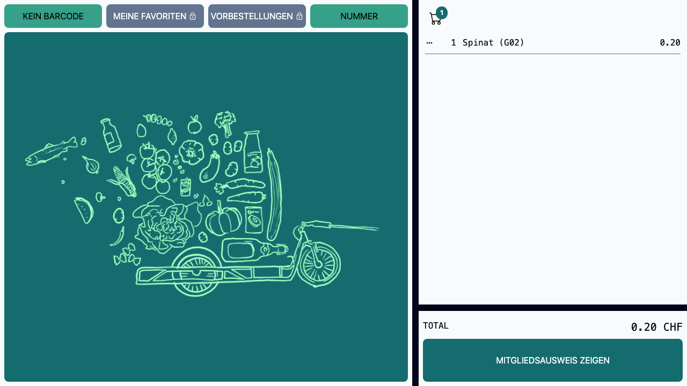
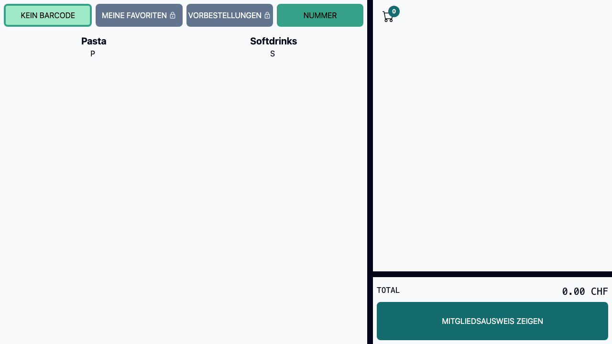
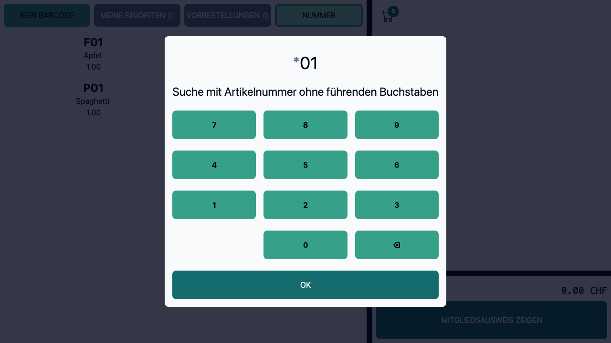
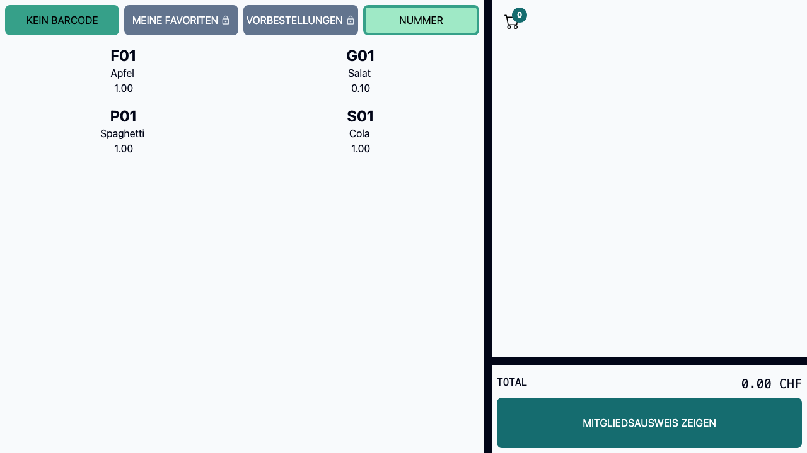
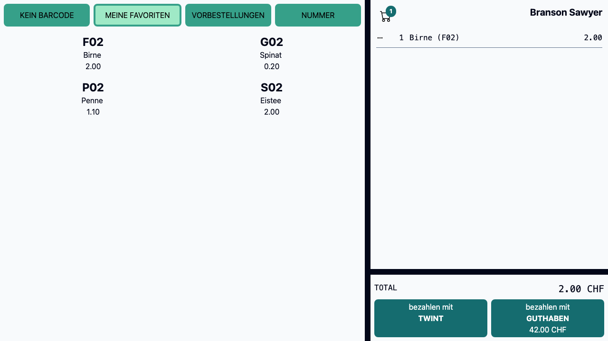
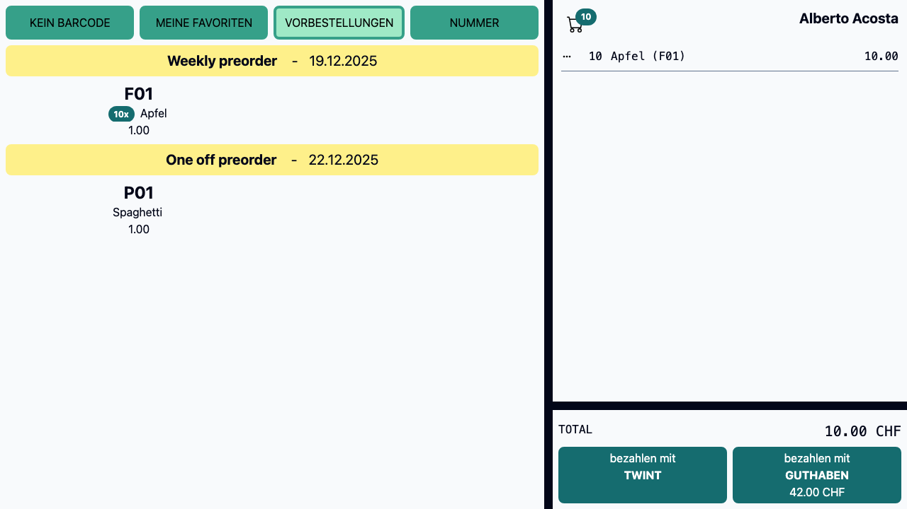
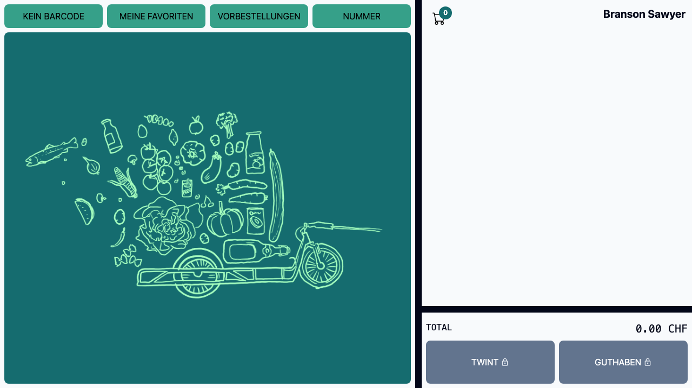
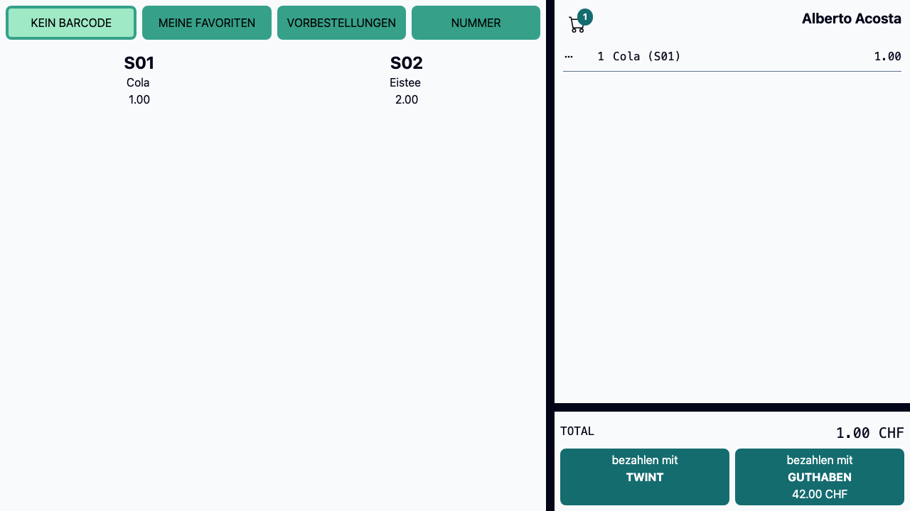
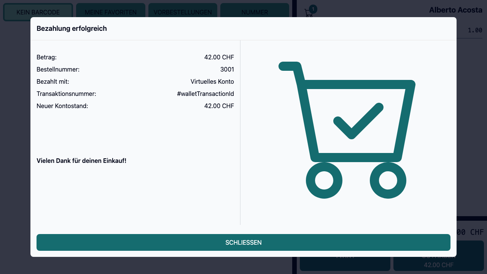

# Features

<!-- TOC -->
* [Features](#features)
  * [Scan by product code](#scan-by-product-code)
    * [Supports multiple barcodes per product](#supports-multiple-barcodes-per-product)
    * [Support weight encoded barcodes](#support-weight-encoded-barcodes)
  * [Search by category](#search-by-category)
  * [Search by article Id](#search-by-article-id)
  * [Search by past orders (favorites)](#search-by-past-orders-favorites)
  * [Search by pre-orders](#search-by-pre-orders)
  * [Pay with virtual wallet](#pay-with-virtual-wallet)
  * [Pay with Twint](#pay-with-twint)
<!-- TOC -->

## Scan by product code

### Supports multiple barcodes per product

* A product can have multiple barcodes in a semicolon separated list (i.e. `111111111111;222222222222`)

### Support weight encoded barcodes

* A product can have a weight encoded barcode
* The weight is added to the cart automatically
* The barcode has the weight replaced with `w` and is followed by a `c` (i.e. `210987654wwwwc`)

## Search by category

* Products without barcode are grouped by category (i.e. Fruits and Softdrinks)

## Search by article Id

* Enter a part of the articles ID and press OK to search for the product.

## Search by past orders (favorites)

## Search by pre-orders

* Integrates with the [WooCommerce OnDemand Lists](https://github.com/quartier-depot/Quartierdepot---OnDemand-Lists) plugin.
* Adds the pre-ordered quantity to the cart in one click (i.e. 10 apples) 

## Pay with virtual wallet

* Integrates with the [TeraWallet Plugin](https://wordpress.org/plugins/woo-wallet/)

## Pay with Twint

* Integrates with [Payrexx](https://payrexx.com/de-ch)

