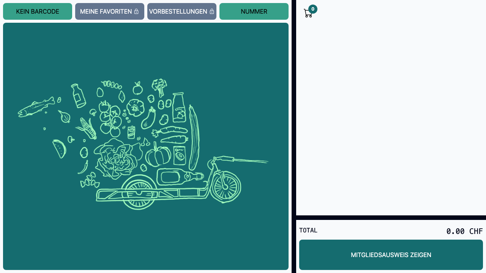

# Woocommerce Self-Checkout Point Of Sale

A self-checkout POS using a WooCommerce backend tailored for [Quartier Depot](https://www.quartier-depot.ch/).

## Features

* Scan by product code
* Supports multiple barcodes per product
* Support weight encoded barcodes
* Search by category or article Id
* Search by past orders (favorites)
* Search by pre-orders (pick-up)
* Pay with virtual wallet
* Pay with Twint



For more screenshots see [FEATURES.md](./FEATURES.md)

### Watch on YouTube

[](https://www.youtube.com/watch?v=EAuKzgOIUrg)

## Backend prerequisites

* Wordpress 
* WooCommerce 
  * User with role "Shop-Manager"
  * WooCommerce REST-API Key for shop-manager with read/write rights (`woocommerce-consumer-key` and `woocommerce-consumer-secret`)
* ACF
  * Products with field `barcode`, `artikel-id` and `freitext`
  * Customers with field `member_id`
* Plugin [quartierdepot-memberid](https://github.com/quartier-depot/quartierdepot-memberid)
  * Exposes `acf/member_id` field in customer DTO of Woocommerce REST API

## Techstack

- Vite
- React
- Typescript
- React Redux
- Tailwind
- Express

## Development

### Install

```bash
$ cd ./app
$ npm install
```

### Run (react app)

```bash
$ npm run dev
```

Create `.env` file first with `.env.template` in `./app` folder.


### Run (express server)

```bash
$ cd ./app
$ npm install
$ npm run build
$ cd ../server
$ npm install
$ npx dotenvx run -f ../app/.env -- node webserver.cjs
```

### Run (container)

```bash
$ podman build -t quartier-depot-self-checkout -f Containerfile . 
$ ipconfig getifaddr en0
$ podman run --env-file ./app/.env.TEST --add-host=<wordpress>:<ip> -p 3000:3000 localhost/quartier-depot-self-checkout:latest
```

Note: adding `--add-host=<wordpress>:<ip>` is only required, if the Wordpress instance runs locally (i.e. with https://localwp.com/)

## Release

1. In `/app` run `npm run build`, `npm run test`, `npm run e2e`
2. Determine next version number (i.e. `git tag`)
3. Set the version in both [app/package.json](./app/package.json) and in [server/package.json](./server/package.json) 
4. Commit and push
5. Tag the codebase (i.e. `git tag 1.0.0`) 
6. Push `git push --tags`.
7. A [GitHub action](./.github/workflows/publish.yml) builds the container and publishes it (see https://github.com/quartier-depot/self-checkout/actions)

## Install

1. Create GitHub PAT
2. Prepare an `.env` file.
3. `echo $CR_PAT | podman login ghcr.io -u USERNAME --password-stdin`
4. `podman run --env-file .env -p 3000:3000 ghcr.io/quartier-depot/self-checkout:latest`

## Update

1. `podman stop --all`
2. Re-run with `:latest`

### Recommended IDE Setup

* [VSCode](https://code.visualstudio.com/)
* [ESLint](https://marketplace.visualstudio.com/items?itemName=dbaeumer.vscode-eslint)
* [Prettier](https://marketplace.visualstudio.com/items?itemName=esbenp.prettier-vscode)

## Deployment at Quartierdepot

Although there are other deployment options (like hosting on a Webserver),
we deploy the application directly to the POS device in a container.

The container runs an Express server internally and takes care of calls to the backend,
keeping the secrets save (they are not exposed to the browser and encrypted for backend communication)
and taking care of CORS (all calls from web application are routed through a proxy).

See also [setup.md](./doc/setup.md)

## Credits

Kudos to the following projects for source code and inspiration:

- Sound Effect "beep" by [zerolagtime](https://freesound.org/people/zerolagtime/) from [freesound.org](https://freesound.org/)
- Sound Effect "confirm" by [floraphonic](https://pixabay.com/users/floraphonic-38928062) from [pixabay](https://pixabay.com)
- Point of Sale: https://point-of-sale.dev/
- Tailwind POS: https://github.com/emsifa/tailwind-pos
- WooCommerce POS: https://wcpos.com / https://github.com/wcpos