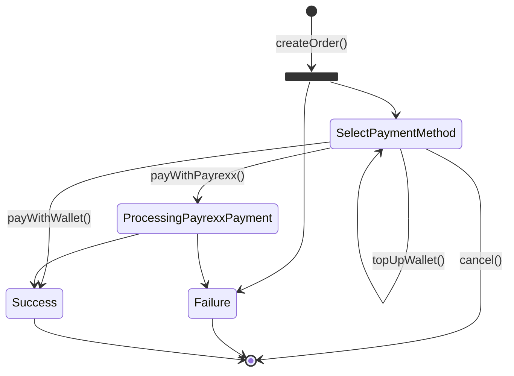

```mermaid

stateDiagram
    state CreatingOrder <<fork>>
    
    [*] --> CreatingOrder: createOrder()
    
    CreatingOrder --> SelectPaymentMethod
    CreatingOrder --> Failure
    
    SelectPaymentMethod --> SelectPaymentMethod: topUpWallet()
    SelectPaymentMethod --> Success: payWithWallet()
    SelectPaymentMethod --> ProcessingPayrexxPayment: payWithPayrexx()
    SelectPaymentMethod --> [*]: cancel()

    ProcessingPayrexxPayment --> Success
    ProcessingPayrexxPayment --> Failure
    
    Failure --> [*]
    Success --> [*]
```