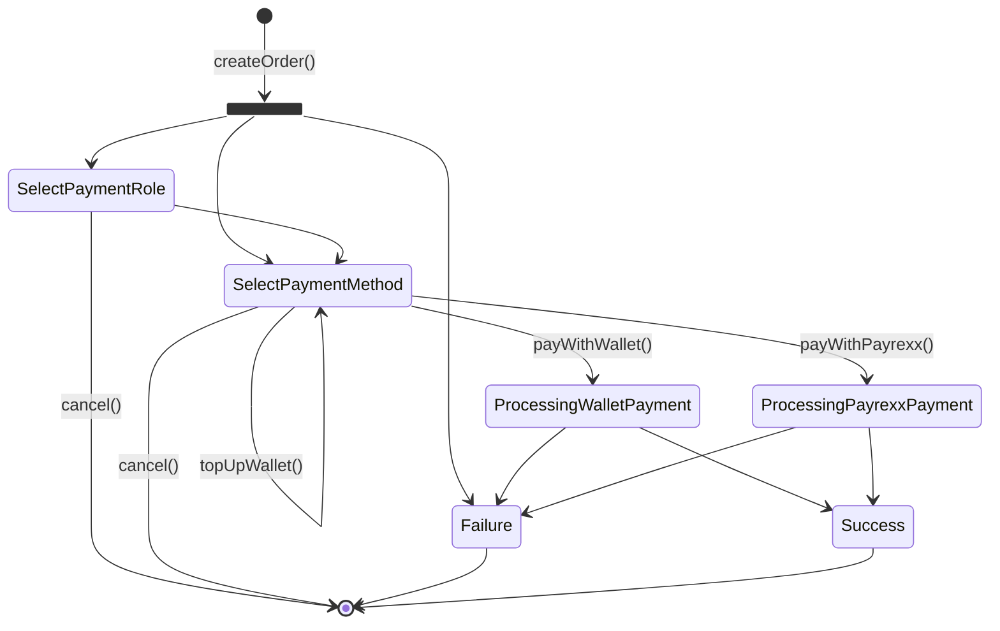

```mermaid

stateDiagram
    state CreatingOrder <<fork>>
    
    [*] --> CreatingOrder: createOrder()
    
    CreatingOrder --> SelectPaymentRole
    CreatingOrder --> SelectPaymentMethod
    CreatingOrder --> Failure
    
    SelectPaymentRole --> [*]: cancel()
    SelectPaymentRole --> SelectPaymentMethod
    
    SelectPaymentMethod --> SelectPaymentMethod: topUpWallet()
    SelectPaymentMethod --> ProcessingWalletPayment: payWithWallet()
    SelectPaymentMethod --> ProcessingPayrexxPayment: payWithPayrexx()
    SelectPaymentMethod --> [*]: cancel()

    ProcessingWalletPayment --> Success
    ProcessingWalletPayment --> Failure

    ProcessingPayrexxPayment --> Success
    ProcessingPayrexxPayment --> Failure
    
    Failure --> [*]
    Success --> [*]
```