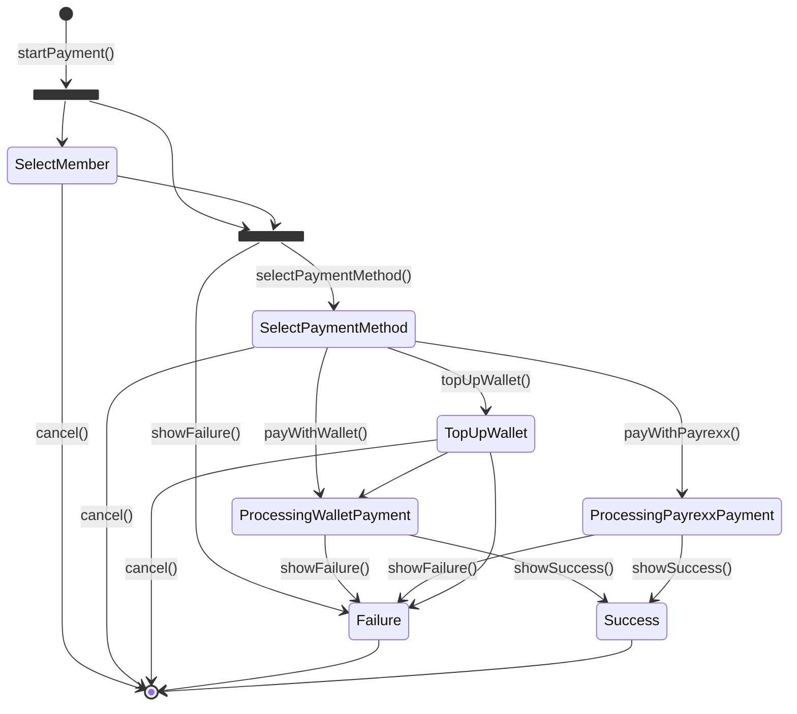

```mermaid

stateDiagram
    state StartingPayment <<fork>>
    state CreatingOrder <<join>>
    
    [*] --> StartingPayment: startPayment()

    StartingPayment --> CreatingOrder
    StartingPayment --> SelectMember
    SelectMember --> [*]: cancel()
        
    SelectMember --> CreatingOrder
    CreatingOrder --> SelectPaymentMethod: selectPaymentMethod()
    CreatingOrder --> Failure: showFailure()

    SelectPaymentMethod --> TopUpWallet: topUpWallet()
    SelectPaymentMethod --> ProcessingWalletPayment: payWithWallet()
    SelectPaymentMethod --> ProcessingPayrexxPayment: payWithPayrexx()
    SelectPaymentMethod --> [*]: cancel()

    ProcessingWalletPayment --> Success: showSuccess()
    ProcessingWalletPayment --> Failure: showFailure()

    ProcessingPayrexxPayment --> Success: showSuccess()
    ProcessingPayrexxPayment --> Failure: showFailure()

    TopUpWallet --> ProcessingWalletPayment
    TopUpWallet --> Failure
    TopUpWallet --> [*]: cancel()
    
    Failure --> [*]
    Success --> [*]
```