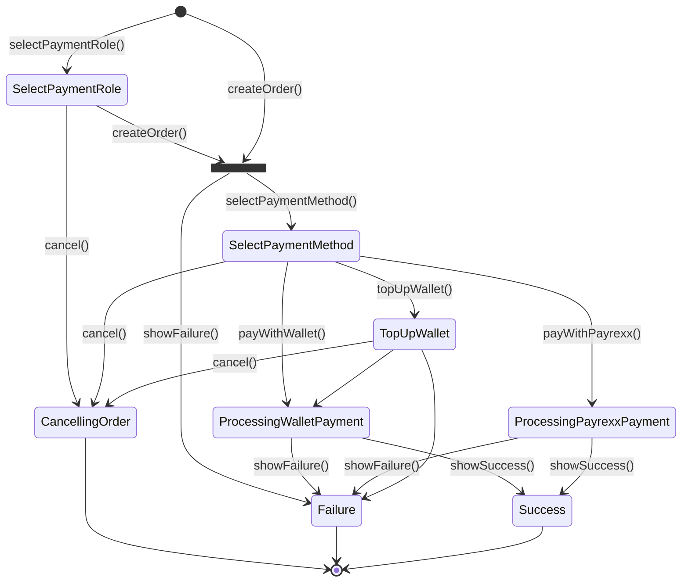

```mermaid

stateDiagram
    state CreatingOrder <<join>>
    
    [*] --> SelectPaymentRole: selectPaymentRole()
    SelectPaymentRole --> CreatingOrder: createOrder()
    [*] --> CreatingOrder: createOrder()

    SelectPaymentRole --> CancellingOrder: cancel()
        
    CreatingOrder --> SelectPaymentMethod: selectPaymentMethod()
    CreatingOrder --> Failure: showFailure()

    SelectPaymentMethod --> TopUpWallet: topUpWallet()
    SelectPaymentMethod --> ProcessingWalletPayment: payWithWallet()
    SelectPaymentMethod --> ProcessingPayrexxPayment: payWithPayrexx()
    SelectPaymentMethod --> CancellingOrder: cancel()

    ProcessingWalletPayment --> Success: showSuccess()
    ProcessingWalletPayment --> Failure: showFailure()

    ProcessingPayrexxPayment --> Success: showSuccess()
    ProcessingPayrexxPayment --> Failure: showFailure()

    TopUpWallet --> ProcessingWalletPayment
    TopUpWallet --> Failure
    TopUpWallet --> CancellingOrder: cancel()

    CancellingOrder --> [*]
    
    Failure --> [*]
    Success --> [*]
```